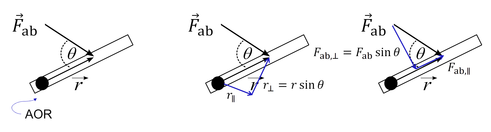
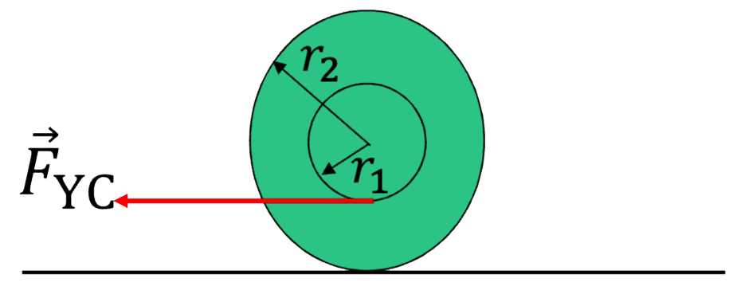

# PHYSICS 1 - Mechanics

## Kinematics

### Topic 1-1: 1-Dimensional Kinematics

#### Calculus Based Equations

- $v_{x}(t)\equiv \frac{dx(t)}{dt}$
- $a_{x}\equiv \frac{dv_{x}(t)}{dt}=\frac{d^2x(t)}{dt^2}$
- $x(t) = x(t_{i})+ \int_{t_{i}}^{t}v_{x}(t') \, dt'$
- $v_x(t) = v(t_{i})+ \int_{t_{i}}^{t}a_{x}(t') \, dt'$

##### Example #1

The acceleration of a train moving in a straight line is given by $a_x(t) = \left(5.7 \frac{\text{m}}{\text{s}^3} \right) \cdot t$. If its velocity at $t_{i}= 1 \text{s}$ is $v_{i,x} = 2.93 \text{m}/\text{s}$, what is its velocity at $t_{f} = 3 \text{s}$

- $$v_{f,x} = v_{i,x} + \int_{t_i}^{t_f} a_{x}(t') \, dt'$$

> Let $c = 5.7 \frac{\text{m}}{\text{s}^3}$

- $$v_{f,x} = v_{i,x} + \int_{t_i}^{t_f} ct' \, dt$$
- $$v_{f,x} = v_{i,x} + \frac{1}{2}ct^3 \bigg\rvert_{t_i}^{t_f}$$
- $$v_{f,x} = v_{i,x} + \frac{1}{2}c (t_{f}^2 + t_{i}^2)$$

##### Example #2

The acceleration of a train moving in a straight line is given by $a_x(t) = \left(5.7 \frac{\text{m}}{\text{s}^3} \right) \cdot t$. If its velocity at $t_{i}= 1 \text{s}$ is $v_{i,x} = 2.93 \text{m}/\text{s}$, what is its displacement at $t_{f} = 3 \text{s}$

- $$v_{f,x} = v_{i,x} + \int_{t_i}^{t_f} a_{x}(t') \, dt'$$

> Let $c = 5.7 \frac{\text{m}}{\text{s}^3}$

- $$v_{f,x} = v_{i,x} + \int_{t_i}^{t} ct' \, dt$$
- $$v_{f,x} = v_{i,x} + \frac{1}{2}ct^3 \bigg\rvert_{t_i}^{t}$$
- $$v_{f,x} = $$
- $$\Delta x = \int_{t_i}^{t_f} \left(v_{i,x} + \frac{1}{2}c (t^2 + t_{i}^2)\right) \, dx$$
- $$\Delta x = \left[ v_{i,x} t + \frac{1}{6}ct^3 - \frac{1}{2}ct_{f}^2 t \right]_{t_i}^{t_{f}} $$
- $$\Delta x = v_{i,x} (t_f - t_i) + \frac{1}{6}c(t_{f}^{3}-t_{i}^{3}) - \frac{1}{2}ct_{f}^2 (t_f - t_i)$$

### Topic 1-2: Vector Mathematics I

$$\begin{align*}\vec{V}& =V_{x}\hat{i}+V_{y}\hat{j}+ V_{z}\hat{k}\\ V &= \sqrt{V_{x}^2+V_{y}^2+V_{z}^2} \end{align*}$$

Displacement: $\Delta \vec{r} = \Delta x\hat{i} + \Delta y\hat{j}+\Delta z\hat{k}$

Weight: $\vec{WE_b} = -m_b \cdot g\hat{j}$

#### Example #1

Let $\vec{V_1} = \langle 3, 4\rangle$ and $\vec{V_2} =\langle -4,-3\rangle$. $\vec{V_4} = \vec{V_{1}} - \vec{V_{2}}$

$V_{4} = \langle 3, 4\rangle - \langle -4, -3\rangle = \langle 7,7 \rangle$
$$\boxed{V_{4x} > 0 \text{ and } V_{4y}>0}$$

#### Example #2

Let $\vec{V_1} = \langle 3, 4\rangle$ and $\vec{V_2} =\langle -4,-3\rangle$. $\vec{V_5} = -\vec{V_{1}} + \vec{V_{2}}$

$\vec{V_5} =  -\langle 3,4 \rangle + \langle -4, -3\rangle = \langle -7,-7 \rangle$

$V_5 = \sqrt{2\cdot 49} = 2\sqrt{2}$

#### 2D Vector Functions

  

If $\vec{a}(t) = a_{0}e^{\frac{t}{t_i}}\hat{i}$ and $\vec{v}(t_i)$ is shown, then what is $\vec{v}(t_f) = \vec{v}(t_i) +\int_{t_i}^{t_f} \vec{a}(t)\, dt$

Steps:

$$\begin{align*} v_{x}(t_f) &= v_{x}(t_i) + \int_{t_i}^{t_f}a_x(t)\, dt\\ & = v_{i}\sin \theta + \int_{t_f}^{t_i}a_{0}e^{\frac{t}{t_i}} \, dt \\ & = v_{i}\sin \theta + a_{0}t_{i}e^{\frac{t}{t_i}} \bigg\rvert_{t_i}^{t_f}  \\ &= v_i \sin\theta + a_0 t_i (e^{\frac{t_f}{t_i}}-e^1) \end{align*} $$

$$\begin{align*}v_{y}(t_f) &= v_{y}(t_i) + \int_{t_i}^{t_f}a_y(t)\, dt \\ &= v_i\cos\theta + \int_{t_i}^{t_f} 0 \, dt\\ &= v_i\cos\theta \end{align*}$$

$$\boxed{\vec{v}(t_{f}) = [v_i \sin\theta + a_0 t_i (e^{\frac{t_f}{t_i}}-e^1)]\hat{i} + [v_i\cos\theta]\hat{j}}$$

### Topic 1-3: Problem Solving in Two-Dimensional Kinematics

#### Equations

1. $\vec{r}(t)=x(t)\hat{i}+y(t)\hat{j}$
2. $v(t)=|\vec{v}(t)|=\sqrt{v_{x}(t)^2+v_{y}(t)^2}$
3. $\vec{v}(t)=\frac{d\vec{r}(t)}{dt} = \vec{v}(t_{i})+\int_{t_i}^{t}\vec{a}(t')\, dt'$
4. $\vec{a}(t)=\frac{d\vec{v}(t)}{dt}$
5. $\vec{r}(t)=\frac{d\vec{r}(t)}{dt} = \vec{r}(t_{i})+\int_{t_i}^{t}\vec{v}(t')\, dt'$
6. For SPM: $\vec{a}(t)=0\hat{i}-g\hat{j}$

#### Example 1

##### Part 1

Four identical baseballs are thrown across a baseball
field with the same initial speed, but they are tossed
at different launch angles $\theta$. Air resistance is
negligible along each trajectory. Rank the paths
according to the time the baseball is in the air.

  

$$\boxed{D<C<B<A}$$

**Conceptual:** Bigger values of $v_{i,y}$ take longer to slow to zero with the same $a_y$

- $y(t_{hit})=y(0)$
- $v_{y}(t_{hit})=-v_{y}(0)$
- $v_{y}(t_{peak})=0$

$v_{y}(t_{peak}) = v_{y}(0)+\int_{0}^{t_{peak}}-g \, dt \rightarrow 0 = v_{i}\sin\theta-gt_{peak} \rightarrow t_{peak} = \frac{v_{i}\sin\theta}{g} \rightarrow t_{hit}=2t_{peak}$

As $\theta$ increases, $t_{hit}$ increases for $(0 < \theta<90^{\circ})$

##### Part 2

How far does each travel horizontally?

**Unknown:** $x(t_{hit})$

**Knowns:** $v_{i},\theta, a_{y}=-g, a_{x}=0, t_{hit}=\frac{2v_{i}\sin\theta}{g}$

- $v_{x}(t)=v_{x}(0)+ \int_{0}^{t}a_{x}(t')\, dt' = v_{i}\cos\theta$
- $x(t_{hit})=x(0)+\int_{0}^{t_{hit}} v_{x}(t)\, dt = 0 + v_{i}\cos\theta \cdot t_{hit} = v_{i}\cos\theta \left(\frac{2v_{i}\sin\theta}{g}\right) =\frac{2v_{i}^2\sin\theta\cos\theta}{g} = \underbrace{\boxed{\frac{2v_{i}^2\sin2\theta}{g}}}_{\text{Maximum when } \theta = 45^{\circ}}$

#### Example 2

An airplane’s vertical acceleration $a_{y}(t)$ depends on its horizontal speed $v_{x}(t)$. If the plane’s vertical and horizontal components of acceleration are $a_{y}(t)=\left[\left(\frac{v_{x}(t)}{v_{i,x}} - 1\right)\right] \cdot g$ and $a_{x}(t)=Bt$ find the speed $v(t)$ of the plane in terms of $v_{i,x}$, $v_{i,y}$ $B$, and $g$. Assume $t_{i}=0$.

1. $$\begin{align} v_x (t) &= v_x(0)+ \int_{0}^{t}a_{x}(t')\, dt\\ &= v_{i,x}+\int_{0}^{t}Bt'\, dt'\\ &= v_{i,x}+ \frac{1}{2}Bt^2 \end{align}$$

2. $$\begin{align}v_{y}(t) &= v_{y}(0)+\int_{0}^{t} a_y(t')\, dt \\ &= v_{i,y}+\int_{0}^{t}\left[\left(\frac{v_{x}(t)}{v_{i,x}} - 1\right)\right] g\, dt'\\ &= v_{i, y} + \int_{0}^{t} \\ &= v_{i,y}+ \int_{0}^{t} \left[\frac{v_{i,x}+ \frac{1}{2}Bt'^2}{v_{i,x}} - 1\right] g \, dt' \\ &= v_{i,y}+ \int_{0}^{t} \left[\frac{v_{i,x}+ \frac{1}{2}Bt'^2}{v_{i,x}} - \frac{v_{i,x}}{v_{i,x}}\right] g \, dt' \\ &= v_{i,y}+ \int_{0}^{t} \left[\frac{ \frac{1}{2}Bt'^2}{v_{i,x}}\right] g \, dt' \\ &= v_{i,y} + \frac{Bt^3}{6v_{i,x}}g\end{align}$$

3. $$\begin{align}|\vec{v}(t)| &= \sqrt{\vec{v}_{x}(t)^2+\vec{v}_{y}(t)^2}\\ &= \sqrt{\left(v_{i,y} + \frac{Bt^3}{6v_{i,x}}g\right)^2+ \left(v_{i,x}+ \frac{1}{2}Bt^2\right)^2} \end{align}$$

### Topic 1-4: Advanced Kinematics

#### Equations

- $$\vec{v}_{av}\bigg\rvert_{t_i}^{t_f} = \frac{1}{t_f-t_i} \int_{t_i}^{t_f}\vec{v}(t) \, dt = \frac{\vec{r}(t_f)-\vec{r}(t_i)}{t_f-t_i}$$
- $$\vec{a}_{av}\bigg\rvert_{t_i}^{t_f} = \frac{1}{t_f-t_i} \int_{t_i}^{t_f}\vec{a}(t) \, dt = \frac{\vec{v}(t_f)-\vec{v}(t_i)}{t_f-t_i}$$

##### Example 1

A car undergoes an acceleration $a_x(t)$ from $t_1$ to $t_2$. Given $v_x(t)$ and $x(t_1)$, what is the correct expression for $x(t_2)$?
$$x(t_2) = x(t_1)+ \int_{t_1}^{t_2}\left[v_x(t_1)+ \int_{t_1}^{t}a_{x}(t')\, dt'\right]\, dt$$

##### Example 2

From $t_1$ to $t_2$, $a_A(t)$. From $t_2$ to $t_3$, $a_B(t)$. Given $v_x(t_1)$, how fast is it moving at $t_3$ i.e. $v_x(t_3)=$?

- $v_{A,x}(t) = v_{A,x}(t_1)+\int_{t_1}^{t} a_{A,x}(t')\, dt'$

- $v_{A,x}(t_2) = v_{A,x}(t_1)+\int_{t_1}^{t_2} a_{A,x}(t)\, dt$

- $v_{B,x}(t) = v_{A,x}(t_2) + \int_{t_2}^{t} a_{B,x}(t')\, dt'$

- $v_{B,x}(t_3) = \underbrace{v_{A,x}(t_1)+\int_{t_1}^{t_2} a_{A,x}(t)\, dt}_{v_x(t_2)} + \underbrace{\int_{t^2}^{t_3} a_{B,x}(t)\, dt}_{\Delta v_x}$

##### Example 3

Given $v_{car, x}(t)$ and $v_{\text{moto},x}(t)$,two vehicles reach same final position at the same time i.e. $v_{\text{car},x} \neq v_{\text{moto},x}(t)$ and $x_{\text{car}}(t_f) = x_{\text{moto}}(t_f)$.

- $x_{\text{car}}(t_i)-x_{\text{moto}}(t_i)=0$
- $x_{\text{car}}(t_f) = x_{\text{car}}(t_i) + \int_{t_i}^{t_f} v_{\text{car},x}\, dt$
- $x_{\text{moto}}(t_f) = x_{\text{moto}}(t_i) + \int_{t_i}^{t_f} v_{\text{moto},x}\, dt$
- $x_{\text{car}}(t_i) + \int_{t_i}^{t_f} v_{\text{car},x}\, dt = x_{\text{moto}}(t_i) + \int_{t_i}^{t_f} v_{\text{moto},x}\, dt$
- $x_{\text{car}}(t_i)-x_{\text{moto}}(t_i) = \int_{t_i}^{t_f} v_{\text{moto},x} \, dt - \int_{t_i}^{t_f} v_{\text{car},x}(t)\,dt$

##### Example 4

Given the velocity graph shown, which is true about $v_{av}, x$ $a_{av,x}$ and from $t=t_i$ to $t=t_f$?

  

- $v_{av,x} < 0$
- $a_{av,x}>0$
- $\Delta x < 0$

1. $v_{av, x} = \frac{1}{\Delta t} \underbrace{\int_{t_i}^{t_f}v_x(t)\, dt}_{\text{Area under the curve < 0}} = \frac{\Delta x}{\Delta t}$

2. $v_{av, x} = \frac{1}{\Delta t} \underbrace{\int_{t_i}^{t_f}a_x(t)\, dt}_{\text{Slope of the secant line > 0}} = \frac{\Delta v_x}{\Delta t}$

## Newtonian Dynamics I - Translation

### Topic 2-1: Force, Inertia, and Newton's Laws

#### Forces

1. Gravitational or Weight: $\vec{F}_{G,Eb}$ or $\vec{W}_{Eb}$

2. Spring: $\vec{F}_{sp,ab}$

3. Normal: $\vec{N}_{TB}$

4. Friction: $\underbrace{\vec{f}_{s,TB}}_{\text{Static}}$ or $\underbrace{\vec{f}_{k,TB}}_{\text{Kinetic}}$

5. Tension: $\vec{T}_{SB}$

Forces #1 - #2: Magnitude and direction known in advance

Forces #3 - #5: Components of contact force Need to use N2L to determine magnitude and/or direction

Things in PHGN100 that are NOT Forces:

- Velocity
- Inertia
- Pressure
- Centripetal acceleration (Topic 3-1)
- Torque (Topic 4-2)

#### Newtons Laws

1. In an inertial frame, an object will move with a constant velocity unless acted
   upon by a net external force.

2. The acceleration of a system is proportional to the net external force and inversely proportional to its inertial mass.

$$\text{sys}=b: \Sigma_{j} \vec{F}_{j,b} = \vec{F}_{1,b} + \vec{F}_{2,b} + \cdots \vec{F}_{N,b}$$
$$\vec{a}_{b} = \frac{\Sigma_{j} \vec{F}_{j,b}}{m_{b}}$$
$$\Sigma_{j} \vec{F}_{j,b} = m_{b}\vec{a}_{b}$$

3. If object $a$ exerts a force on another object $b$, there is an equal and opposite force
   acting from object $b$ on object $a$.
   $$\vec{F}_{ab} = -\vec{F}_{b,a}$$
   $$F_{ab}=F_{ba}$$

### Topic 2-2: Friction

#### Equations

- $f_{k,ab} = \mu_{k}N_{ab}$
- $f_{s,ab} \leq \mu_{s}N_{ab}$
- $f_{s,ab \text{ max}} = \mu_{s}N_{ab}$

#### Examples

  

##### Problem 1

You pull on a block as shown. If the magnitude $\vec{F}_{Yb}$ of your force is unchanged, but the angle $\theta$ is increased, how does the magnitude of the normal force $\vec{N}_{tb}$ from the table on the block change?

Note: $(a_{b,y} =0)$
$$\sum_{j}\vec{F}_{jb} = m_{b}\vec{a}_b$$
$$y: N_{tb}-W_{Eb} - F_{Yb}\sin(\theta) = \underbrace{m_{b}\vec{a}_{a,y}}_{0}$$
$$N_{tb} = m_{b}g + F_{Yb}\sin(\theta)$$

##### Problem 2

You pull on a block as shown which is slipping to the right. If the magnitude $F_{Yb}$ of your force is unchanged, but the angle $\theta$ is increased, how does the magnitude of the friction force from the table on the block change? <mark>(Kinetic Friction)<mark>

$f_{k, tb}= \mu_{k}N_{tb} \therefore$ As $\theta$ increases $N_{tb}$ must increases.

##### Problem 3

You pull on a block as shown, but the block does not slip. If the magnitude $F_{Yb}$ of your force is unchanged, but the angle $\theta$ is increased, how does the magnitude of the friction force from the table on the block change?

$(\vec{a}_b=0)$

For static friction: $f_{s,tb} \leq \mu_{s}N_{tb}\cdots$ Since we don't know if its at the max value, this doesn't help us. But we can use N2L!

$$x: F_{Yb}\cos\theta - f_{s,tb} = m_{b}\underbrace{a_{b,x}}_{0}$$
$$F_{Yb}\cos\theta = f_{s,tb}$$
$$\boxed{\therefore f_{s,tb}\downarrow \text{ as } \theta \uparrow}$$

### Topic 2-3: Newtonian Dynamics Problem Solving Process

#### Problem Solving Process

1. Read and organize information. Read the entire problem first and then (if one is not provided) draw a picture representing the physical situation. On your picture (or the one provided) label and/or define quantities as needed. List quantities that are given (knowns) and the quantities you would like to solve for (unknowns).

2. Choose and analyze your system(s). State which objects you will study and (if necessary) draw a free body diagram or extended free body diagram for that system that is consistent with your picture. Indicate any known velocities and accelerations in your picture or next to (but not on) the FBD/EFBDs. For some problems, you may need to do this more than once.

3. Choose your physics tool(s). State which physics tool(s) you will use to solve the problem so that someone with a similar level of physics knowledge can easily interpret them. All of the tools we will use in this class are listed on the equation sheet if you ever need a reminder.

4. Choose your coordinate system(s). Draw these on your picture, FBD, and/or EFBD, and then re-write your tools in terms of the coordinates and any known quantities you were given in the problem. Do your work symbolically at this point.

5. Compare the number of equations you have to the number of unknowns. If the number of equations you have from your tools is equal to the number of unknowns you need to solve for, then you should have enough information to solve the problem. If you need more equations, consider any extra information or special conditions that might apply to the situation and write these as additional equations.

6. Solve the equations for the unknowns. Typically, this will involve algebra, but in some cases you will need kinematics and/or calculus to complete the solution. Check that the dimensions and extremes of your final answer(s) make sense. Plug in numerical quantities only at the end. PHGN 100 Problem Solving Process

#### Examples

##### Example 1

  

A Blaster of mass $m_B$ is at rest and attached by cables at the center of a square room on Earth as shown. Given the magnitude of the tension $T_{1B}$, find $T_{2B}$.

**Knowns:** $m_B,g,T_{1B},v_b=0, a_B=0, \theta=45^{\circ}$
**Unknowns:** $T_{2B}, T_{3B}$

$x: T_{2B}=T_{1B}\cos\theta - T_{3B}\cos\theta=m_{B}a_{B,x} = 0$

$y: T_{1B}\sin\theta - T_{3B}\sin\theta-W_{EB} = m_Ba_{B,y} = 0$

$$\Longrightarrow T_{3B}=T_{1B}-\frac{m_Bg}{\sin\theta}$$
$$\Longrightarrow T_{2B}=\left(2T_{1B}-\frac{m_Bg}{\sin\theta}\right)\cos\theta$$

##### Example 2

  

A train is on level ground and moving with a constant acceleration. A Blaster with mass $m_B$ is hanging from a string attached to the ceiling of the train, and the string makes an angle $\theta$ with respect to the vertical. Derive expressions for the magnitude of the acceleration of the train $a_T$ and the tension in the rope connecting the train and Blaster $T_{TB}$.

**Knowns:** $m_B,g,\theta$

**Unknowns:** $a_T, T_{TB}$

$x: T_{TB}\sin\theta = ma_{B,x} = ma_{T}$

$y: T_{TB}\cos\theta -W_{EB} = ma_{B,y}$

$$T_{TB} = \frac{m_{B}g}{\cos \theta}$$

> As $\theta \to 0, T_{Tb} \to m_{b}g$ As $\theta \to 90^{\circ}, T_{Tb} \to \infty$
> $$a_{T} = \frac{m_{B}g\sin\theta}{m_B\cos\theta} = g\tan\theta$$

### Topic 2-4: Multi-Object Dynamics

  

#### Multi-Object Dynamics I

Now we can solve for the magnitude of the force of static friction
between the block and the cart using the values below.

**Unknowns:** $f_{s,BC},a_B = a_C= a_{B+C}$

System = $B+C$

$x: F_{YB} = (m_B+m_C)a_x$

$a_x= \frac{F_{YB}}{m_B+m_C}$

System = $C$

$x:f_{s,BC} = m_Ca_x$

$f_{s,BC} = \frac{m_C F_{YB}}{m_B+m_C} = 71.4 \text{ N}$

Does not slip if $f_{s,BC}< f_{s,BC \max}$ where $f_{s,BC} = \mu_s N_{BC}$

## Newtonian Dynamics II - Advanced Translation

### Topic 3-1: Circular Motion

#### Equations

  

**Centripetal:** $a_c(t)=\frac{v_t(t)^2}{R} = \omega(t)^2R$, responsible for changing direction of $\vec{v}$

**Tangential:** $a_t(t)= \frac{\mathrm{d}v_t(t)}{\mathrm{d} t} = R\alpha(t)$, responsible for changing magnitude of $\vec{v}$.

**Angular kinematic quantities:** $\theta(t)=\frac{s(t)}{R}, \omega(t)=\frac{\mathrm{d}\theta(t)}{\mathrm{d} t},\alpha(t) = \frac{\mathrm{d}\omega(t)}{\mathrm{d}t}$

Uniform circular motion is a specific type of motion in which an object travels in a circle with a constant speed. For example, any point on a propeller spinning at a constant rate is executing uniform circular motion.

Sys=C

$\longrightarrow \Sigma_{j}\vec{F_{jG}} = m_G\vec{a_G}\\ \longrightarrow \Sigma_{j}\vec{F_{jG,c}} = m_Ga_{G,c}\\ \longrightarrow \Sigma_{j}\vec{F_{jG,t}} = m_Ga_{G,t}$

##### Example 1

  

The gray turntable is spinning at a constant angular speed $\omega$. If the green disk and red disks are identical (same mass,material, shape, coefficient of static friction, etc.), which disk is more likely to slip off the turntable?

Slips when $f_{s,td} = f_{s,td \max}$, thus we need to find both.

**Unknown:** $f_{s,td} = f_{s,td \max}$

**Knowns:** $\omega, m_d, \mu_s, R$

The acceleration of the disk is towards the centre of the circle.

$$y: N_{td} -m_dg= m_da_{d,y} \longrightarrow f_{s,td \max} = \mu_sN_{td} = \mu_sm_dg$$

$$c: f_{s,td}= m_d\left(\frac{v^2}{R}\right)= m_d\left(\omega^2R\right)$$

same $m$ and $\omega$ different $v$ and $R$

**Answer:** The red disk is more likely to slip.

##### Example 2

A motorcyclist is rounding a flat curve at a
constant speed $v$. She is more likely to slip if she
rides along the outside edge of the curve.

##### Example 3 - Tangential Acceleration in Nonuniform Circular Motion

Blaster (with mass $m_b$) moves around a circle of radius $R= 2 \text{ m}$ with an angular position $\theta(t)=kt^2$, where $𝑘= 180 \text{ deg/s}^2$. Calculate the magnitude of the net force at
time $𝑡 = 2 \text{ s}$.

**Knowns:** $R,k,t,\theta(t),m_b$

**Unknowns:** $a(t),\ldots a_c(t), a_t(t), \omega(t)$

$$a(t)=\sqrt{a_c(t)^2+a_t(t)^2}$$
$$a_c(t)=R\omega(t)^2$$
$$\omega(t) =\frac{\mathrm{d}\theta}{\mathrm{d}t} = 2kt$$
$$a_c(t)=4Rk^2t^2$$
$$a_t(t)=R \alpha (t)$$
$$\alpha(t)=\frac{\mathrm{d}\omega}{\mathrm{d}t} = 2k$$
$$a_t(t)=2R$$
$$a(t)=\sqrt{(4Rk^2t^2)^2+(2Rk)^2}$$
$$N2L \longrightarrow F(t)=m_ba(t)$$

### Topic 3-2: Simple Harmonic Motion

#### Notes

- $x_0$ or $y_0$ is the position of end of unstretched or uncompressed spring

- $x_{\text{eq}}$ or $y_{\text{eq}}$ is the position of end of spring at equilibrium

- The restoring force from an ideal spring: $F_{\text{sp ab, }x} = – k[x(t)– x_0]$

- The net external force in SHM: $\Sigma F_x = – k[x(t)– x_{\text{eq}}]$

- $\Sigma F_x$ always restores the mass back towards $x_{\text{eq}}$, so the system will
  oscillate about $x_{\text{eq}}$, not necessarily $x_0$!

#### Equations

$$ a*x(t)=-\omega^2\left[x(t)-x*{\text{eq}}\right]$$
$$x(t)=A\cdot\sin(\omega t+\delta)+ x\_{\text{eq}}$$
$$f=\frac{1}{T}; \omega = 2\pi f = \frac{2\pi}{T}$$

#### Plotting SHM

> $\delta =\frac{\pi}{2}$, $x_{\text{eq}} =0$

  

$$x(t)=A\sin(\omega t+ \delta)$$
$$v_x(t)=A\omega\cos(\omega t+ \delta)$$
$$\begin{align*} a_x(t)&=-A\omega^2\sin(\omega t+ \delta)\\ &=-\omega^2\left(x(t)-x_{\text{eq}}\right)\end{align*}$$

#### Example 1

Blaster (with mass $m_B$) is attached to a fixed wall by two springs and slides with negligible friction on the table as shown. Both springs obey Hooke’s Law and have the same natural length $x_0$, but different spring constants. Find the frequency of oscillation of Blaster.

> $\text{System}= B$

**Knowns:** $m_B, g, k_1,k_2,x_0$

**Unknowns:** $f,\omega$

$$\begin{align*} m_{B}a_{x} &= F_{\text{sp 1} B} + F_{\text{sp 2} B} \\ m_{B}a_{x} &= -k_{1}[x(t)-x_0]-k_2[x(t)-x_0]\\ a_x(t)&=\frac{-k_{1}[x(t)-x_0]-k_2[x(t)-x_0]}{m_B}\\ a_x(t)&=\frac{-(k_1+k_2)}{m_B}\cdot \left[x(t)-x_0\right]\\ \omega &= \sqrt{\frac{(k_1+k_2)}{m_B}}\\ f&=\frac{\omega}{2\pi}\\ f &= \boxed{\frac{1}{2\pi}\sqrt{\frac{(k_1+k_2)}{m_B}}} \end{align*}$$

#### Example 2

Blaster is attached to two fixed walls by springs and slides with negligible friction on the table. Both springs remain stretched throughout the motion and have different spring constants. What is the angular frequency of oscillation of Blaster?
$$k_{\text{eff}}=k_1+k_2$$
$$\boxed{\omega = \sqrt{\frac{k_{\text{eff}}}{m_B}}}$$

## Block 4: Newtonian Dynamics III - Rotation

### Topic 4-1: Vector Mathematics II

#### Cross Product

$$
\begin{align*}
\vec{V_1} \times \vec{V_2} &= \left(V_{1x}\hat{i}+V_{1y}\hat{j}+ V_{1z}\hat{k}\right) \times \left(V_{2x}\hat{i}+V_{2y}\hat{j}+ V_{2z}\hat{k}\right)\\&= \left(V_{1y}V_{2z}-V_{1z}V_{2y}\right)\hat{i}+ \left(V_{1z}V_{2x}-V_{1x}V_{2z}\right)\hat{j}+\left(V_{1x}V_{2y}-V_{1y}V_{2x}\right)\hat{k}\\
&= \left|\begin{matrix} \hat{i} & \hat{j} & \hat{k}\\ V_{1x} & V_{1y} & V_{1z} \\V_{2x} & V_{2y} & V_{2z} \end{matrix} \right|\\
&= V_{1}V_{2}\sin(\theta); \, \text{Direction given by RHR}
\end{align*}
$$

#### Dot Product

$$
\begin{align*}
\vec{V_1} \cdot \vec{V_2} &= V_{1x}V_{2x}+V_{1y}V_{2y}+V_{1z}V_{2z}\\
&= V_{1}V_2\cos(\theta)
\end{align*}
$$

#### Line Integral

A book (b) is sitting on the ground, and you pick it up and put it on a table as
shown. For this process, calculate the following (called a line integral):

- $\vec{s_i} = x_i\hat{i}+y_i\hat{j}$
- $\vec{s_i} = x_f\hat{i}+y_f\hat{j}$
- $\vec{W_{Eb}} \cdot  \mathrm{d} \vec{s} = -m_bg\hat{j} \cdot(\mathrm{d}x\hat{i}+\mathrm{d}y\hat{j}) = -m_bg\,\mathrm{d}y$

$$
\begin{align*}
\int_{\vec{s_i}}^{\vec{\vec{s_f}}} \vec{W_{Eb}} \cdot  \mathrm{d} \vec{s} &= \\
&= \int_{y_i}^{y_f} -m_bg\, \mathrm{d}y \\
&= -m_{b}g (y_f-y_i)
\end{align*}
$$

### Topic 4-2: Torque, Moment of Inertia, and Newton's 2nd Law for Rotation

#### Equations

$$\sum_{j} \vec{\tau}_{F_{jb}} = \vec{\tau}_{\text{net},b} = I_{b}\vec{\alpha}_{b}$$
$$I_b=cm_bd^2; c = \text{constant}$$
$$\vec{\tau}_{F_{ab}} = \vec{r}\times\vec{F}_{ab}$$
$$\tau_{F_{ab}}=rF_{ab}\sin\theta = r_{\bot}F_{ab}=rF_{ab \bot}$$

  

#### Torque

  

#### Comparing Torque

  

> Note: $d_1 > d_2 > d_3$, and drawn to scale

All systems are in equilibrium. In which case is the torque from the hanging block about the black dot largest?

#### EFBD

For Newton’s 2nd Law of Translation, we didn’t have to worry about where the force acted: $\sum_{j} \vec{F}_{jb} = m_b \vec{a}_{b\mathrm{cm}}$ But for Newton’s 2nd Law of Rotation, we must! $\vec{W}_{Eb}$ can draw as acting at the COM. For $\vec{N}_{gb}$ and $\vec{f}_{s,gb}$ need to use N2LR to figure out where to draw them.
$\sum_{j} \vec{F}_{jb} = m_{b} \vec{a}_{b\mathrm{cm}}$

#### Example

  

Block ($B$) is at rest on the inclined plane (P). This implies that $\sum_{j} \vec{\tau}_{jB} = \vec{0}$ about any axis. Which EFBD below has the normal force in the correct location?

  

### Topic 4-3: Problem Solving with Newtonian Dynamics

#### Example 1

  

A block of mass $m_b$ hangs from a cable that is attached to the end of a uniform strut of length $L$ and mass $m_s$. The strut is pinned at one end and also joined to the ground by a rope attached a distance d from the pin as shown.

1. Find the tension in the rope between the ground to the strut.

$$\vec{\alpha} = \vec{0}, \Sigma \vec{\tau} =\vec{0}, \vec{a}=\vec{0}, \Sigma \vec{F} = \vec{0}$$
**Knowns:** $m_b,g,L,m_s,d$

**Unknowns:** $T_{\mathrm{gs}}$

$$\text{AOR}: \tau_{T_{\mathrm{gs}}}- \tau_{W_{\mathrm{Eb}}} = 0$$
$$dT_{\mathrm{gs}}\sin\theta - \frac{L}{2}m_sg\sin\phi - Lm_bg\sin\phi=0$$

$$T_{\mathrm{gs}} = \frac{Lg\sin\phi \left(\frac{1}{2}m_s+m_b\right)}{d\sin\theta}$$

2. Now that we have $T_{\mathrm{gs}}$, how would you find $F_{\mathrm{ps}}$?

> N2L in both $x$ and $y$ directions

$$\Sigma F_{\mathrm{jsys},x} = 0 \longrightarrow T_{\mathrm{gs}}\sin\left(\theta+\phi\right)$$
$$\Sigma F_{\mathrm{jsys},y} = 0 \longrightarrow T_{\mathrm{gs}}\cos\left(\theta+\phi\right) + \left(m_s+m_b\right)g$$

$$F_{\mathrm{ps}} = \sqrt{F_{\mathrm{ps},x}^2+ F_{\mathrm{ps},x}^2}$$

#### Example 2

A block with mass $m_b$ hangs from a string that is wrapped around a physical pulley with radius $R_p$ and moment of inertia $I_p$. The pulley can rotate about an axle $(a)$ with negligible friction. If the block $(b)$ is released from rest, the magnitude of the tension between the block and the pulley is: **less than** $m_bg$

### Topic 4-4: Rolling

  

#### Rollin’, Rollin’, Rollin’

A solid spherical ball starts from rest and rolls without slipping down an inclined plane. Which direction is the friction force on the ball?

$$\boxed{\text{Up the plane}}$$

> $\vec{a}_{\mathrm cm}$ and $\vec{\alpha}_{cm}$ are linked.

  

#### The Rolling Race

Three round objects start from rest and roll without slipping down an inclined plane. Which one reaches the bottom first?

1. $I_{\mathrm{sphere}}= \frac{2}{5}MR^2$

2. $I_{\mathrm{cylinder}}= \frac{1}{2}MR^2$

3. $I_{\mathrm{hoop}}= MR^2$

4. $I_{\mathrm{round~object}}= c \cdot MR^2$

**Knowns:** $\vec{f}_{\mathrm{s,pb}}$, $\theta$, $\vec{N}_{\mathrm{pb}}$, & $\vec{W}_{\mathrm{Eb}}$

The object with the biggest $\vec{a}_{\mathrm{cm}}$ (and $\vec{\alpha}_{\mathrm{cm}}$) will win. Solve for $\vec{\alpha}_{\mathrm{cm}}$ using N2LT, N2LR, and the no-slip condition.

$$x: m_{\mathrm{b}}g\sin\theta - f_{\mathrm{s,pb}} = m_{\mathrm{b}}a_{\mathrm{b,cm}}$$
$$\text{AOR}: f_{\mathrm{s,pb}}R=I_{\mathrm{cm}}\alpha_{\mathrm{b,cm}}$$
$$\text{No Slip}: R\alpha_{\mathrm{b,cm}} = a_{\mathrm{b,cm}}$$

$$f_{\mathrm{s,pb}} = \frac{I_{\mathrm{cm}}a_{\mathrm{b,cm}}}{R^2}$$
$$m_{\mathrm{b}}g\sin\theta - \frac{I_{\mathrm{cm}}a_{\mathrm{b,cm}}}{R^2} = m_{\mathrm{b}}a_{\mathrm{b,cm}}$$
$$a_{\mathrm{b,cm}} = \frac{m_{\mathrm{b}}g\sin\theta}{m_{\mathrm{b}+ \left(I_{\mathrm{cm}}/R^2\right)}}$$

$$a_{\mathrm{b,cm}} = \underbrace{\frac{g\sin\theta}{1+c}}_{\text{Substituting using the equations above}}$$

$$\boxed{\text{The round object will have the smallest value of $c$ and thus will have the largest $a_{\mathrm{b,cm}}$.}}$$

#### The Rolling Race

You are going to race two hoops down an incline plane. $\text{Hoop 1}$ is larger and heavier than $\text{Hoop 2}$, with $R_1=2R_2$ and $m_1=2m_2$. Which one reaches the bottom first? Recall $I_{\mathrm{hoop}}= MR^2$.

$$\boxed{\text{They tie}}$$

The value of $c$ is the same for both hoops i.e., $(c=1)$.

#### The Double-Radius Cylinder

If the double-radius cylinder rolls without slipping on the table under the applied force shown, which way will its COM accelerate?

$$\boxed{\text{To the left}}$$

  

#### The Double-Radius Cylinder (II)

A large cylinder $(r = r_2)$ is welded to two smaller cylinders $(r = r_1)$ that act as an axle. If the small cylinders roll without slipping on the metal rods under the applied force shown, which way will the large cylinder’s COM accelerate?

Guess $\vec{a}_{\mathrm{cm}} \rightarrow$, which implies $\sum \vec{F}_{\mathrm{jC}} \rightarrow$, which implies $\vec{f}_{\mathrm{s,RC}} \rightarrow$ and $\vec{f}_{\mathrm{s,RC}}> F_{\mathrm{YC}}$. No slip implies $\vec{\alpha}_{\mathrm{cm}} \rightarrow$, which implies $\sum\vec{\tau}_{jC}CW$, which implies $r_{2}F_{\mathrm{YC}} > r_{1}f_{\mathrm{s,RC}}$. We CAN have both $\vec{f}_{\mathrm{s,RC}} > F_{\mathrm{YC}}$ and $r_{2}F_{\mathrm{YC}} > r_{1}f_{\mathrm{s,RC}}$.

$$\boxed{\text{To the right}}$$

  

#### The Single-Radius Cylinder

Starting from rest, if the cylinder rolls without slipping on the table under the applied force shown, which way will its center of mass (COM) accelerate?

  

1. Guess $\vec{a}_{\mathrm{cm}} \rightarrow$, which implies $\sum\vec{F}_{\mathrm{jC}} \rightarrow$, which implies $\vec{f}_{\mathrm{s,GC}} \rightarrow$ and $f_{\mathrm{s,GC}}> F_{\mathrm{YC}}$. No slip implies $\vec{\alpha}_{\mathrm{cm}}CW$, which implies $\sum \vec{\tau}_{\mathrm{jC}} CW$, which implies $rF_{\mathrm{YC}}> r f_{\mathrm{s,GC}}$. But we can’t have both $rF_{\mathrm{YC}}> r f_{\mathrm{s,GC}}$ and $rF_{\mathrm{YC}} < r f_{\mathrm{s,GC}}$ , which is a contradiction!

2. Guess $\vec{a}_{\mathrm{cm}} \leftarrow$, which implies $\sum\vec{F}_{\mathrm{jC}} \leftarrow$, which implies $\vec{f}_{\mathrm{s,GC}} \leftarrow$ and $f_{\mathrm{s,GC}}> F_{\mathrm{YC}}$. No slip implies $\vec{\alpha}_{\mathrm{cm}}CCW$, which implies $\sum \vec{\tau}_{\mathrm{jC}} CCW$, which implies $rF_{\mathrm{YC}}< r f_{\mathrm{s,GC}}$. But we can’t have both $rF_{\mathrm{YC}}> r f_{\mathrm{s,GC}}$ and $rF_{\mathrm{YC}} < r f_{\mathrm{s,GC}}$ , which is a contradiction!

$$\boxed{\text{It can't roll}}$$

## The Work-Energy Theorem

### Topic 5-1: Work and Translational Kinetic Energy

#### Equations

- $W_{\mathrm{tot}}= \Delta E_{\mathrm{sys}}$
- $W_{\vec{F}_{\mathrm{ab}}}= \int_{\vec{s}_{i}}^{\vec{s}_f} \vec{F}_{\mathrm{ab}} \cdot d\vec{s}$
- $E_{\mathrm{sys}} = K_{\mathrm{T}}+K_{\mathrm{R}}+E_{\mathrm{therm}}+ U_{\mathrm{g}}+ U_{\mathrm{sp}} + E_{\mathrm{other}}$
- $W_{\mathrm{tot}} = \Delta K_{\mathrm{T}}+\Delta K_{\mathrm{R}}+ \Delta E_{\mathrm{therm}}+ \Delta U_{\mathrm{g}}+ \Delta U_{\mathrm{sp}} + \Delta E_{\mathrm{other}}$
- $K_{\mathrm{T}} = \frac{1}{2}mv^2 \Longrightarrow \Delta K_{T} = \frac{1}{2}m\left(m_{f}^{2}-m_{i}^{2}\right)$

#### Important Points

$$\boxed{W_{\mathrm{tot}} = \Delta E_{\mathrm{sys}}}$$

- Energies/work depend on choice of reference frame. Unless noted, always choose an observer at rest with respect to the ground.
- You must specify the system to determine which forces do work.
  - Force must be EXTERNAL to the system to do work
  - Only displacement of the point where force is applied matters (“force displacement”)
- The work done by a conservative force has the following properties:
  - Independent of the path
  - Depends only on endpoints
  - Closed path → work = 0
- Conservative forces in PHGN100:
  - Gravitational and Ideal Spring

#### For Your Consideration

  

> System: Block

$$W_{\mathrm{tot}} = \Delta E_{\mathrm{sys}}$$

$$W_{\vec{N}_\mathrm{tot}}= 0$$

$$W_{\mathrm{tot}} = W_{\vec{W}_{\mathrm{Eb}}}$$
$$W_{\vec{W}_{\mathrm{Eb}}} = \int_{0}^{\Delta y}m_{b}g \, dy = m_{b}g\Delta y $$

$$v_{f} = \sqrt{2g\Delta y}$$

#### A Childish Question?

A baby is doing push-ups on a level floor. He has a $7 ~\text{kg}$ mass and pushes his body from $5~\text{cm}$ above the floor to $20~\text{cm}$ above the floor. The work done on the baby by the normal force of the floor on the baby is: **equal to zero**.
$$W_{\vec{N}_{\mathrm{fb}}} = \int_{\vec{s}_{i}}^{\vec{s}_f} \vec{N}_{\mathrm{fb}} \cdot d\vec{s} = \int_{y_i}^{y_f}N_{\mathrm{fb}} \, dy = 0$$

- Work is being done on the baby arms.
- If the point of contact is not moving, there is no work by that force application

#### The Sign of Work

A block is initially sliding to the right along a horizontal surface with negligible friction at a speed $v_{i}$. When it passes the point $x_{0}$ a force $\vec{F}_{\mathrm{ab}}$ acting to the left begins to slow it down and reverses its motion. When the object gets back to the point $x_{0}$ it is moving with a speed $v_{f} < v_{i}$.

  

Using the block as the system, from the time from when the
block first passes $x_{0}$ to when it returns to $x_{0}$ the work done by the force $\vec{F}_{\mathrm{ab}}$ is **negative** and the force is **nonconservative**.

$$
\begin{align*}
W_{\mathrm{tot}} &= \Delta E_{\mathrm{sys}}\\
W_{\vec{F}_{\mathrm{ab}}}+\underbrace{W_{\vec{N}_{\mathrm{tb}}}}_{0} + \underbrace{W_{\vec{W}_{\mathrm{EB}}}}_{0}&= \Delta K_{\mathrm{T}}
\end{align*}
$$

$$\Delta K_{\mathrm{T}} = \frac{1}{2}m\left(m_{f}^{2}-m_{i}^{2}\right)$$

$$\Delta K_{\mathrm{T}} < 0 \therefore W_{\vec{F}_{\mathrm{ab}}} <0$$

#### Putting It All Together

  

A block starts at rest and slides a distance $d$ down an incline with negligible friction.

1. What is the work done by gravity on the block?
   $$W_{\vec{F}_{\mathrm{ab}}} = \int_{\vec{s}_i}^{\vec{s}_f} \vec{F}_{\mathrm{ab}} \cdot d\vec{s}$$
   $$\vec{W}_{\mathrm{Eb}}= m_{b}g(\sin\theta) \hat{i} - m_{b}g(\cos\theta) \hat{j}$$
   $$d\vec{s} = dx~\hat{i}+dy~\hat{j}$$
   $$W_{\vec{F}_{\mathrm{ab}}} = \int_{0}^{d} m_{b}g(\sin\theta) \, dx + \int_{0}^{d} m_{b}g(\cos\theta) \, dy = m_{b}g(\sin\theta) \cdot d$$

2. What is the work done by the normal force on the block?

$$W_{\mathrm{tot}} = \vec{W}_{\vec{W}_\mathrm{Eb}} + \underbrace{W_{\vec{N}_{\mathrm{Rb}}}}_{0}$$

$$W_{\mathrm{tot}} = m_{b}g(\sin\theta)\cdot d$$

### Topic 5-2: Rotational Kinetic Energy and Thermal Energy

#### Equations

- $E_{\mathrm{sys}} = K_{\mathrm{T}}+K_{\mathrm{R}}+E_{\mathrm{therm}}+ U_{\mathrm{g}}+ U_{\mathrm{sp}} + E_{\mathrm{other}}$

- $W_{\mathrm{tot}} = \Delta K_{\mathrm{T}}+\Delta K_{\mathrm{R}}+ \Delta E_{\mathrm{therm}}+ \Delta U_{\mathrm{g}}+ \Delta U_{\mathrm{sp}} + \Delta E_{\mathrm{other}}$

- $\displaystyle W_{\vec{F}_{\mathrm{ab}}} = \int_{\vec{s}_{i}}^{\vec{s}_{f}} \vec{F}_{\mathrm{ab}} \cdot d\vec{s} = \int_{\theta_{i}}^{\theta_{f}} \vec{\tau}_{\mathrm{ab}} \cdot d\theta$

- $K_{\mathrm{R}} = \frac{1}{2} I\omega^2$

- $\Delta K_{\mathrm{R}} = \frac{1}{2} I\left(\omega_{f}^2-\omega_{i}^2\right)$

- $E_{\mathrm{therm,ab}} = f_{\mathrm{k,ab}}s_{\mathrm{ab}}$

#### Work-Energy with Rotation I

  

A constant force $\vec{F}_{\mathrm{YC}}$ is applied to a cylinders that start from rest and rotates about a fixed, low-friction axle. After one full revolution, what is the change in its rotational kinetic energy? (System: Cylinder)

$$
\begin{align*}
W_{\vec{F}_{\mathrm{ab}}} &= \int_{\theta_{i}}^{\theta_{f}} \vec{\tau}_{\mathrm{ab}} \cdot d\theta\\
& = \int_{0}^{2\pi} (R)(F_{\mathrm{YC}}) \, d\theta\\
&= (2\pi)(R)(F_{\mathrm{YC}})\\
&= \Delta K_{\mathrm{R}}
\end{align*}
$$

#### Work-Energy with Rotation II

  

A constant force $\vec{F}_{\mathrm{YC}}$ is applied to two identical cylinders that start from restand **(1)** rotates about a fixed, low-friction axle, and **(2)** rolls without slipping on a horizontal surface. After one full revolution, which cylinder has the larger change in (total) kinetic energy?

> Both cylinders traverse the same distance $2\pi R$

$$\boxed{\text{The change in the total kinetic energy is the same.}}$$

#### Work and Rolling Without Slipping cylinder

  

Reconsider the rolling race with a curved ramp. To determine the winner of the race, we will calculate the speed $v_f$ of a round object as it reaches the bottom of the ramp.

$$W_{\mathrm{tot}} = \Delta E_{\mathrm{sys}} = \Delta K_{\mathrm{T}}+ \Delta K_{\mathrm{R}}$$

- $W_{\vec{N}_{\mathrm{RO}}}=0$
- $W_{\vec{f}_{\mathrm{s,RO}}}=0$

$$
\begin{align*}
\vec{W}_{EO} &= (-mg)\hat{j} \, d\vec{s} = (dx)\hat{i}+ (dy){\hat{j}}\\
&= \int_{y_1}^{y_f}(-mg) \, dy \\
&= mg(y_i-y_f)
\end{align*}
$$

$$
\begin{align*}
\Delta E_{\mathrm{sys}}&=\Delta K_{\mathrm{T}}+ \Delta K_{\mathrm{R}}\\
&= \frac{1}{2}m\left(v_{f}^2 -v_{i}^2 \right)+ \frac{1}{2}I\left(\omega_{f}^2 -\omega_{i}^2 \right)\\
mg(y_i-y_f)&= \frac{1}{2} \left(mv_{f}^2+I\omega_{f}^2\right)\\
mg(y_i-y_f)&= \frac{1}{2} \left(mv_{f}^2+(cmR^2)\frac{v_{f}^{2}}{R}\right)\\
mg(y_i-y_f)&= \frac{1}{2}mv_{f}^2\left(1+c\right)
\end{align*}
$$

$$v_{f} = \sqrt{\frac{2g(y_i-y_f)}{1+c}}$$

#### Thermal Energy And Kinetic Friction

  

A $5~\text{kg}$ book slides across a table with an initial kinetic energy of $10~\text{J}$. If kinetic friction between the table and the book $(\mu_k = 0.204)$ causes the book to stop after $1~\text{m}$, how much work does the kinetic friction force do on the book?

> $\Delta E_{\mathrm{therm}}$ is unknown

$$\boxed{\text{Unable to be determined}}$$

#### Thermal Energy And Kinetic Friction II

- Given a force of kinetic friction between two objects and a displacement, the only quantity we can compute is the change in the thermal energy $\Delta E_{\mathrm{therm}}$ of the system that includes both objects.

- This quantity, $\Delta E_{\mathrm{therm}}$, is always positive and depends on the total distance slid $s_{\mathrm{ab}}$.

- $\boxed{\displaystyle \Delta E_{\mathrm{therm,ab}} = \int_{\vec{s}_{i}}^{\vec{s}_{f}} \vec{f}_{\mathrm{k,TB}} \cdot d\vec{s}= f_{\mathrm{k,TB}}s_{\mathrm{ab}}}$

- You cannot compute the “work” done by a kinetic friction force
  **without more information!** (For example: 60% of the thermal
  energy generated goes into the book.)

### Topic 5-3: Potential Energy

#### Equations

- $W_{\text{tot}}= \Delta E_{\mathrm{sys}}$

- $\displaystyle W_{\vec{F}_{\text{ext}}}= \int_{\vec{s}_i}^{\vec{s}_f}\vec{F}_{\text{ext}} \cdot d\vec{s}$

- $\displaystyle U_{\vec{F}_{\text{int}}}= \int_{\vec{s}_i}^{\vec{s}_f}\vec{F}_{\text{int}} \cdot d\vec{s}$

- $\Delta U_{\mathrm{g}}= m_{\mathrm{b}}g\left(y_{\mathrm{b,f}}-y_{\mathrm{b,i}}\right)$

- $\Delta U_{\mathrm{sp}}= \frac{1}{2}k \left( \left(x_{\mathrm{b,f}}-x_0\right)^2-\left(x_{\mathrm{b,i}}-x_0\right)^2\right)$

## The Impulse-Momentum Theorem

### Topic 6-1: The Impulse-Momentum Theorem

#### Equations

- $\displaystyle I_{\vec{F}_{\mathrm{ab}}} \equiv \int_{t_i}^{t_f} \vec{F}_{\mathrm{ab}} \, dt$

- $\displaystyle \vec{p}_{\mathrm{sys}} = m_{\mathrm{sys}}\vec{v}_{\mathrm{sys}}= \sum_{j}m_{j}\vec{v}_{j}$

- $\displaystyle K_{\mathrm{T}}= \frac{p^2}{2m} \Longrightarrow p = \sqrt{2mK_{\mathrm{T}}}$

- $\displaystyle \vec{I}_{\mathrm{net,sys}} = \sum_{j} \vec{I}_{j\text{,sys}} = \Delta \vec{p}_{\mathrm{sys}}$

- $\displaystyle \vec{F}_{\text{net,sys,av}} = \frac{\Delta \vec{p}}{\Delta t}$

#### Comparing W-E and I-M

  

#### Big & Small (I)

A bowling ball and a golf ball are both purely translating with the same (nonzero) momentum. Which has the larger kinetic energy?

$$\boxed{\text{The golf ball}}$$

#### Big & Small (II)

A bowling ball $(m_1)$ and a golf ball $(m_2)$ are both purely translating with the same initial (nonzero) momentum. If you exert the same constant force on each (in the opposite direction of the motion), which takes more time to stop?

- $m_1 > m_2$

- $K_{\text{T}} = \frac{p^2}{2m}$
  $$\boxed{\text{It takes the same time.}}$$

#### Big & Small (III)

A bowling ball and a golf ball are both purely translating with the same initial (nonzero) momentum. If you exert the same constant force on each (in the opposite direction of the motion), which travels further before stopping?

$$\boxed{\text{The golf ball}}$$

#### Stumped?

A normal bullet and a rubber bullet of the same mass are fired at log. Both hit the log with the same initial momentum. The normal bullet lodges itself inside the log, while the rubber bullet bounces off. If the time interval for stopping the normal bullet and reversing the rubber bullet are the same, which one is more likely to knock over the log? Hint: Which one corresponds to a greater average force?

$$\boxed{\text{The rubber bullet}}$$

### Topic 6-2: Collisions

#### Pool Sharks

A cue ball and an eight ball are on a pool table. The cue ball hits the eight ball and the two balls leave the collision as shown. If the initial time is just before the collision between the two balls, and the final time is just after, what is true about the eight ball’s linear momentum during this collision?

  

$$\boxed{\text{It is NOT constant}}$$

#### When is Momentum Constant?

If $\vec{I}_{\text {net,sys }}=\Delta \vec{p}_{\text {sys }}$ then when is $\Delta \vec{p}_{\text {sys }}=\vec{0} ?$
That is, when is momentum constant, i.e. $\vec{p}_{\text {sys }, \mathrm{i}}=\vec{p}_{\text {sys }, \mathrm{f}}$ ?

- If the sum of the forces is zero in a given direction, then momentum is constant in that direction:

$$\boxed{\sum_j \vec{F}_{j, \mathrm{sys}}=\vec{0} \Rightarrow \sum_j \vec{I}_{j, \mathrm{sys}} \equiv \int_{t_{\mathrm{i}}}^{t_{\mathrm{f}}} \sum_j \vec{F}_{j, \mathrm{sys}} d t=\vec{0} \Rightarrow \Delta \vec{p}_{\mathrm{sys}}=\vec{0}}$$

- Also, $\Delta t \sum_j \vec{F}_{j, \text { sys,av }}=\Delta \vec{p}_{\text {sys }}$. So if the time interval is short enough, and the external forces are not too large, then you can also use that momentum is constant:
  $$\boxed{\sum_j \vec{F}_{j, \text { sys,av }} \text { small, and } \Delta t \approx 0 \Rightarrow \Delta t \sum_j \vec{F}_{j, \text { sys,av }}=\Delta \vec{p}_{\text {sys }} \approx \vec{0}}$$

#### Elastic vs. Inelastic

- **Elastic Collisions:** (objects do not deform, microscopic, noncontact and idealized scenarios) Kinetic energy IS constant.

- **Inelastic Collisions:** (objects typically deform, most macroscopic collisions) Kinetic energy is NOT constant.

Classify the following collisions as approximately elastic collision (EC), an inelastic collision (IC), or cannot be treated as a collision (NC):

1. Two billiard balls colliding
2. A satellite “slingshot” around a planet
3. A car crash
4. An object “exploding” into three fragments

$$\boxed{\text{EC, EC, IC, IC}}$$

#### A 2D Collision

  

Two objects of equal mass collide as shown above. If $v_{1i}=3 ~\text{m/s}$, $v_{2i}=4~\text{m/s}$ and $v_{1f}=5 ~\text{m/s}$, is the collision elastic (Yes)?

> Sys = $m_1+m_2$

- $\vec{I}_{\mathrm{net}} = \vec{0} \rightarrow \Delta \vec{p}_{\mathrm{sys}}=\vec{0}$
- $\vec{p}_{\text{i,sys}}=\vec{p}_{\text{f,sys}}$

- $p_{1i,x}+p_{2i,x} = p_{1f,x}+p_{2f,x}$

- $-m_2v_{2i}=-m_1v_{1f}\cos\theta$

- $\displaystyle \cos \theta = \frac{m_2v_{2i}}{m_1v_{1f}}= \frac{v_{2i}}{v_{1f}} \Longrightarrow \arccos\left(\frac{v_{2i}}{v_{1f}}\right) = \theta$

### Topic 6-3: Angular Momentum

#### Equations

- $\vec{L}_{\text{particle}}=\vec{r}\times\vec{p}_{\text{particle}}$

- $\vec{L}_{\text{object}}=I_{\text{object}}\vec{\omega}_{\text{object}}$

- $\displaystyle \sum_{j} \vec{I}_{j,\text{sys}}= \int_{t_i}^{f_f} \sum_{j} \tau_{j,\text{sys}} \, dt = \Delta \vec{L}_{\text{sys}}$

- $\displaystyle K_{\text{R}} =\frac{1}{2}I\omega^2 = \frac{L^2}{2I}$

#### Angular Momentum

  

#### Angular Momentum of a Single Particle

  

If $\vec{v}$ is constant, the particle’s angular momentum at Position 1 (with respect to the point shown) is **the same as** the particle’s angular momentum at Position 2.

$$\boxed{r_{1,\bot}=r_{2,\bot}}$$

#### Angular Momentum of a System of Particles

  

Two objects of mass $50~\text{kg}$ move along parallel paths separated by $3~\text{m}$. Both objects have equal speeds of $2.0 ~\text{m/s}$. What is the magnitude of the total angular momentum of the two-object system about a point that is in the middle of them?

$$L_{B}=\vec{r}_{B,\bot}m\vec{v}_{B}$$
$$L_{R}=\vec{r}_{R,\bot}m\vec{v}_{R}$$
$$|\vec{L}_{\text{total}}|=2r_{\bot}mv = 300~\text{kg}\cdot\text{m}^2/\text{s}$$

#### Reminder: Constant Linear Momentum

If $\vec{I}_{\text {net,sys }}=\Delta \vec{p}_{\text {sys }}$ then when is $\Delta \vec{p}_{\text {sys }}=\vec{0} ?$
That is, when is momentum constant, i.e. $\vec{p}_{\text {sys, } \mathrm{i}}=\vec{p}_{\text {sys, }, \mathrm{f}}$ ?

- If the sum of the forces is zero in a given direction, then momentum is constant in that direction:

$$\boxed{\sum_j \vec{F}_{j, \text { sys }}=\vec{0} \Rightarrow \sum_j \vec{I}_{j, \text { sys }} \equiv \int_{t_{\mathrm{i}}}^{t_{\mathrm{f}}} \sum_j \vec{F}_{j, \text { sys }} d t=\vec{0} \Rightarrow \Delta \vec{p}_{\mathrm{sys}}=\vec{0}}$$

- Also, $\Delta t \sum_j \vec{F}_{j, \text { sys,av }}=\Delta \vec{p}_{\text {sys }}$. So if the time interval is short enough, and the external forces are not too large, then you can also use that momentum is constant:

$$\boxed{\sum_j \vec{F}_{j, \text { sys,av }} \text { small, and } \Delta t \approx 0 \Rightarrow \Delta t \sum_j \vec{F}_{j, \text { sys,av }}=\Delta \vec{p}_{\text {sys }} \approx \vec{0}}$$

#### Constant Angular Momentum

When is angular momentum constant, i.e. $\vec{L}_{\mathrm{sys}, \mathrm{i}}=\vec{L}_{\mathrm{sys}, \mathrm{f}}$ ?

- If the sum of the torques is zero about an axis, then the angular momentum about that axis is constant:

$$\boxed{\sum_j \vec{\tau}_{j, \mathrm{sys}}=\vec{0} \Rightarrow \sum_j \vec{I}_{j, \mathrm{sys}} \equiv \int_{t_{\mathrm{i}}}^{t_{\mathrm{f}}} \sum_j \vec{\tau}_{j, \mathrm{sys}} d t=\vec{0} \Rightarrow \Delta \vec{L}_{\mathrm{sys}}=\vec{0}}$$

- Recall that $\Delta t \sum_j \vec{\tau}_{j, \text { sys,av }}=\Delta \vec{L}_{\text {sys }}$. So if the time interval is short enough, and the external torques are not too large, then you can also use that angular momentum is constant:

$$\boxed{\sum_j \vec{\tau}_{j, \text { sys,av }} \text { small, and } \Delta t \approx 0 \Rightarrow \Delta t \sum_j \vec{\tau}_{j, \text { sys,av }}=\Delta \vec{L}_{\text {sys }} \approx \vec{0}}$$

## More Calculus in Physics

### Topic 7-1:  Potential Energy Functions

#### Equations

$$\Delta U_{\vec{F}_{\mathrm{int}, \mathrm{ab}}}=-\int_{\vec{s}_{\mathrm{i}}}^{\vec{s}_{\mathrm{f}}} \vec{F}_{\mathrm{int}, \mathrm{ab}} \cdot d \vec{s} \\
U_{\vec{F}_{\mathrm{int}, \mathrm{ab}}}= -\int \vec{F}_{\mathrm{int}, \mathrm{ab}} \cdot d \vec{s}
$$

**Examples** *(object a remains at rest)*:

$$
\begin{aligned}
\Delta U_{\mathrm{g}} & =m g\left(y_{\mathrm{f}}-y_{\mathrm{i}}\right) \Rightarrow U_{\mathrm{g}}=m g y+C \\
\Delta U_{\mathrm{sp}} & =\frac{1}{2} k\left(x_{\mathrm{f}}-x_0\right)^2-\frac{1}{2} k\left(x_{\mathrm{i}}-x_0\right)^2 \Rightarrow U_{\mathrm{sp}}=\frac{1}{2} k x^2+C
\end{aligned}
$$

#### Analyze this ...

##### Part 1

A particle $b$ moves along the x-axis subject to a single conservative force that varies as $\vec{F}_{\mathrm{ab}}=(-A+Bx+Cx^2)\: \hat{\mathbf{i}}$, where $A=1~\text{N}$,$B=1~\text{N/m}$ and $A=1~\text{N/m}^2$ , and object a remains at rest. If $b$ is released from rest at $x=-0.5$, determine its subsequent motion.

System: $a$ and $b$

$W_{\mathrm{tot}} = \Delta E_{\mathrm{sys}}$

$$\begin{align*}
-\int\vec{F}_{\mathrm{ab}} \, d\vec{s} &=\\
U_{\vec{F}_{\mathrm{int,ab}}} &= Ax-\frac{1}{2}Bx^2-\frac{1}{3}Cx^2\\
\end{align*}$$

##### Part 2

  

##### Part 3
Now if $b$ is released at $x=-1~\mathrm{m}$ with $2~\text{J}$ of kinetic energy, determine its subsequent motion.

$$\boxed{\text{It will oscillate in the valley.}}$$

##### Part 4
Now if $b$ is released at $x=0~\mathrm{m}$ with $1~\text{J}$ of kinetic energy, determine its kinetic energy when it reaches the point 🟢 shown below.

  

$$\boxed{2~\text{J}}$$

#### Getting $\vec{F}_{\text {int }, a b}$ from $U_{\vec{F}_{\text {int }, a b}}$
If we have a potential energy function then we can "undo" the integral to find the associated force:

$$\boxed{\begin{align*}
 \vec{F}_{\text {int }, a b} &=-\vec{\nabla} U_{\vec{F}_{\text {int }, a b}}(x,y,z) =-\frac{\partial U_{\vec{F}_{\text {int }, a b}}}{\partial x} \hat{i}-\frac{\partial U_{\vec{F}_{\text {int }, a b}}}{\partial y} \hat{j} -\frac{\partial U_{\vec{F}_{\text {int }, a b}}}{\partial z} \hat{k} \\
 \vec{F}_{\text {int }, a b} &=-\vec{\nabla} U_{\vec{F}_{\text {int }, a b}}(r) =-\frac{\partial U_{\vec{F}_{\text {int }, a b}}}{\partial r} \hat{r} \\
\end{align*}}$$

**Note:** This uses the "gradient" or 3D slope of the potential function.

*Examples:*

$$
\begin{array}{ll}
U_{\mathrm{g}}=m g y & U_{\mathrm{sp}}=\frac{1}{2} k\left(x-x_0\right)^2 \\
\Rightarrow \vec{W}_{\mathrm{Eb}}=-\frac{d}{d y}(m g y) \hat{\jmath}=-m g \hat{\jmath} & \Rightarrow \vec{F}_{\mathrm{sp}, a b}=-\frac{d}{d x}\left[\frac{1}{2} k\left(x-x_0\right)^2\right] \hat{\imath}=-k\left(x-x_0\right) \hat{\imath}
\end{array}
$$

#### Getting equilibrium from $U_{\vec{F}_{\mathrm{int},ab}}$

If we have the potential energy function then we can determine the equilibrium positions and their stability by:

$$\boxed{\left.\frac{d U_{\vec{F}_{\mathrm{int}, a b}}(x)}{d x}\right|_{x_{\mathrm{eq}}}=0,\left.\frac{d^2 U_{\vec{F}_{\mathrm{int}, a b}}(x)}{d^2 x}\right|_{x_{\mathrm{eq}}}\left\{\begin{array}{l}
>0 \text { stable } \\
<0 \text { unstable }
\end{array}\right.}$$

**Note:** This uses the slope and concavity of the potential energy function.

#### Test Your Understanding

Particle $b$ starts from rest at point $\mathbf{(i)}$ and moves in the potential shown. Where will it have the largest speed and where will it have the largest magnitude of acceleration?

  

$$\boxed{v_{\text{max}}~\text{at}~\mathbf{(ii)}~\text{and}~a_{\text{max}}~\text{at}~\mathbf{(i)}}$$

#### Why do we care about PE functions?

1. They allow us to determine the total energy of a system, which is a useful physical quantity.

2. They allow us to qualitatively describe the motion.

3. They allow us to identify and characterize equilibrium positions.

4. They allow us to do quantitative calculations that would  otherwise be pretty hard.

$$\boxed{\text{F, T, T, F}}$$

### Topic 7-2:  Inertial Calculus

$$\begin{aligned}
& \textbf { Discrete: } m_{\mathrm{tot}}=\sum_i m_i ; \quad I=\sum_i I_i ; \quad \vec{r}_{\mathrm{cm}}=\frac{1}{m_{\mathrm{tot}}} \sum_i \vec{r}_i m_i \\
& \textbf { Continuous: } m_{\mathrm{tot}}=\int d m ; I=\int d I ; \quad \vec{r}_{\mathrm{cm}}=\frac{1}{m_{\mathrm{tot}}} \int \vec{r}_{\mathrm{cm}, \mathrm{dm}} \,dm
\end{aligned}$$

- $\text{1-D: } dm=\lambda dl  \text { where } \lambda=\text { mass/unit length }(\mathrm{kg} / \mathrm{m})$

- $\text{2-D: } d m=\sigma d A  \text { where } \sigma=\text { mass/unit area }\left(\mathrm{kg} / \mathrm{m}^2\right)$

- $\text{3-D: } d m=\rho d V  \text { where } \rho=\text { mass/unit volume }\left(\mathrm{kg} / \mathrm{m}^3\right)$

#### 2D Continuous Mass Distribution

The 2-D object shown below has mass density which varies as $\sigma\left(x\right) = \lambda_{0}\left(a-x\right).$
We want to calculate the object’s

1. total mass, $m_{\text{tot}}$
2. moment of inertia about the $y$-axis, $I_y$−axis
3. moment of inertia about the $x$-axis, $I_x$−axis
4. position of the center of mass, $\vec{r}_{\text{cm}}$

  

  

#### Moments of Inertia, $I$ and $dI$

#### Inertial Integrals
Calculating an Object's Center of Mass

$$
\begin{array}{r}
x_{\mathrm{cm}, \mathrm{tot}}=\frac{1}{m_{\mathrm{tot}}} \int x_{\mathrm{cm}, \mathrm{dm}} d m \\[1em]
\vec{r}_{\mathrm{cm}, \mathrm{tot}}=\frac{1}{m_{\mathrm{tot}}} \int \vec{r}_{\mathrm{cm}, \mathrm{dm}} d m \Rightarrow y_{\mathrm{cm}, \mathrm{tot}}=\frac{1}{m_{\mathrm{tot}}} \int y_{\mathrm{cm}, \mathrm{dm}} d m \\[1em]
z_{\mathrm{cm}, \mathrm{tot}}=\frac{1}{m_{\mathrm{tot}}} \int z_{\mathrm{cm}, \mathrm{dm}} d m
\end{array}
$$
$\vec{r}_{\mathrm{cm}, d m} \quad$... points from origin to center of mass of $d m$

- NOTE: You must include limits in your integral!

### Topic 7-3:  Advanced Gravitation

#### Equations 

$$\begin{aligned}
& \vec{r}_{21}=\vec{r}_1-\vec{r}_2 \\
& \vec{F}_{21}=-G \frac{m_2 m_1}{r_{21}^2} \hat{r}_{21}=-G \frac{m_2 m_1}{r_{21}{ }^3} \vec{r}_{21} \\
& \vec{g}\left(\vec{r}_1\right)=-\sum_{k=2}^N G \frac{m_k}{r_{k 1}^2} \hat{r}_{k 1}=-\sum_{k=2}^N G \frac{m_k}{r_{k 1}^3} \vec{r}_{k 1}
\end{aligned}$$

$$
\vec{F}_{21}=-G \frac{m_2 m_1}{r_{21}{ }^2} \hat{r}_{21}=-G \frac{m_2 m_1}{r_{21}{ }^3} \vec{r}_{21}
$$

- Relative position vector: $\vec{r}_{21}=\vec{r}_1-\vec{r}_2$

- Unit vector: $\hat{r}_{21}=\vec{r}_{21} / r_{21}$

- Attractive force: Always pulls in ("gravity sucks")

- Intrinsically satisfies Newton's $3^{\text {rd }}$ Law: 

$\vec{F}_{21}=-\vec{F}_{12}$

  

#### A New Idea: The Gravitational Field 

- Recall ... to calculate the force on a mass $m_1$ due to a collection of other masses we used:
$$
\begin{aligned}
\vec{F}_{\text {net }, 1} & =\vec{F}_{21}+\vec{F}_{31}+\vec{F}_{41} \cdots \\
& =-G \frac{m_2 m_1}{r_{21}{ }^3} \vec{r}_{21}-G \frac{m_3 m_1}{r_{31}{ }^3} \vec{r}_{31}-G \frac{m_4 m_1}{r_{41}{ }^3} \vec{r}_{41} \cdots \\
& =\sum_{k=2}^N\left(-G \frac{m_k m_1}{r_{k 1}{ }^3} \vec{r}_{k 1}\right)
\end{aligned}
$$
- Since $m_1$ is common in every term, we can factor it out of the sum to obtain:
$$
\vec{F}_{\text {net }, 1}=m_1 \underbrace{\sum_{k=2}^N\left(-G \frac{m_k}{r_{k 1}{ }^3} \vec{r}_{k 1}\right)}_{\vec{g}\left(\vec{r}_1\right)}
$$
- For a given system of masses, the term $\vec{g}\left(\vec{r}_1\right)$ only depends on the position $\vec{r}_1$. If we want to calculate the force on a new mass $m_{\text {new mass }}$ at the same position $\vec{r}_1$, then we just replace $m_1$ by $m_{\text {new mass }}$ to get
$$
\vec{F}_{\text {net,new mass }}=m_{\text {new mass }} \vec{g}\left(\vec{r}_1\right)
$$
